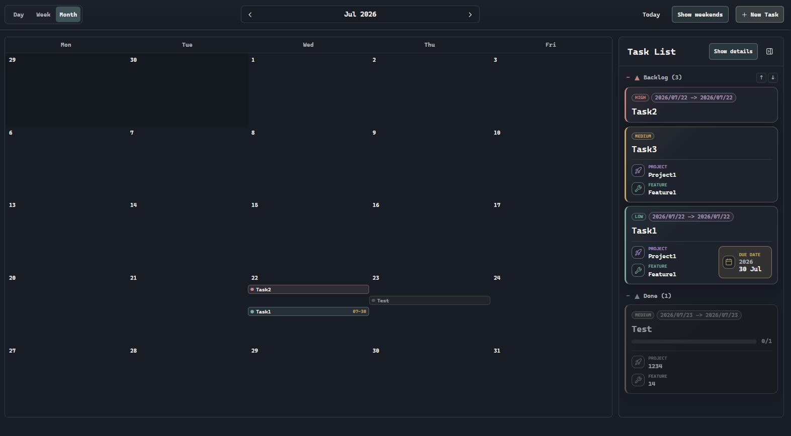
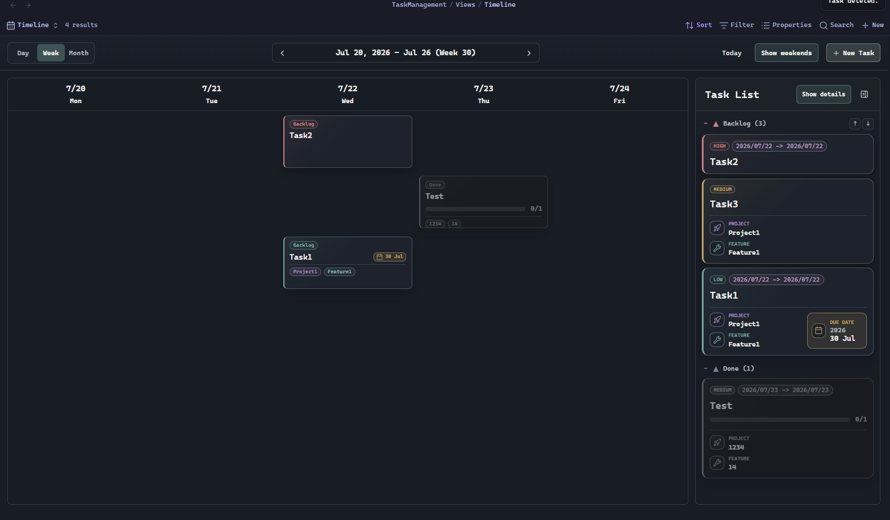

# TaskManagement

TaskManagement is an Obsidian plugin for managing Markdown-based tasks with a kanban board and timeline views.

Tasks are stored as regular Markdown notes with frontmatter, so your task data stays portable, searchable, and readable by Obsidian Bases. The plugin adds custom Bases views for planning work by status, date, project, feature, priority, and custom fields.

## Screenshots

### Timeline month view



### Timeline week view



## Features

- Kanban-style task management powered by Markdown task notes.
- Timeline views for planning tasks by day, week, or month.
- A side task list that keeps grouped tasks visible while browsing the timeline.
- Drag tasks between status columns to update their frontmatter.
- Built-in statuses: `backlog`, `nextup`, `ongoing`, and `done`.
- Add, rename, remove, and reorder statuses from plugin settings.
- Create tasks from the ribbon, command palette, hotkeys, or view toolbar.
- Edit task details directly from the task card.
- Open the source Markdown note from the edit modal.
- Store project and feature references as Markdown links.
- Automatically create project and feature notes when needed.
- Track priority, due date, work start date, work end date, completion date, and notification lead time.
- Apply a completion date when a task moves to `done`, and remove it when the task moves out of `done`.
- Show priority labels, date ranges, project links, feature links, and checklist progress on task cards.
- Sort tasks by built-in fields or custom fields.
- Filter tasks with nested AND/OR filter groups.
- Add custom fields for text, number, date, datetime, date range, select, and checkbox values.
- Refresh Bases views automatically when task files change.

## How It Works

TaskManagement creates a `TaskManagement/` folder in your vault. Task notes live in `TaskManagement/Tasks/`, project notes live in `TaskManagement/Projects/`, and generated Bases view files live in `TaskManagement/Views/`.

Each task is a normal Markdown file with frontmatter similar to this:

```yaml
---
tags:
  - taskmanagement
title: Example task
status: backlog
priority: high
due: 2026-07-30
project: "[[Project1]]"
feature: "[[Feature1]]"
created: 2026-07-26T12:00:00.000Z
---
```

Because tasks are regular notes, you can still search them, link to them, edit them manually, and use them with other Obsidian workflows.

## Commands

- Open Kanban board
- Open Timeline
- Create Kanban task

The plugin also adds a ribbon icon for opening the board.

## Requirements

- Obsidian `1.10.0` or newer.
- The Obsidian Bases core plugin must be enabled to use the custom kanban and timeline views.

## Manual Install

Download the release files and place them in:

```text
<vault>/.obsidian/plugins/frontmatter-kanban-board/
```

Required files:

- `main.js`
- `manifest.json`
- `styles.css`

Restart Obsidian or reload plugins, then enable **TaskManagement** in Community Plugins.

## Development

Install dependencies:

```bash
npm install
```

Build the plugin:

```bash
npm run build
```

Run a development watch build:

```bash
npm run dev
```

## Releasing

Obsidian installs community plugins from GitHub Releases. The release tag must exactly match the `version` in `manifest.json`, without a `v` prefix.

Build and package the release files:

```bash
npm run release:package
```

This validates the release metadata and copies the installable files to:

```text
release/frontmatter-kanban-board/
```

Upload these files as separate GitHub Release assets:

- `main.js`
- `manifest.json`
- `styles.css`

## Roadmap

Recurring tasks are not implemented yet.
